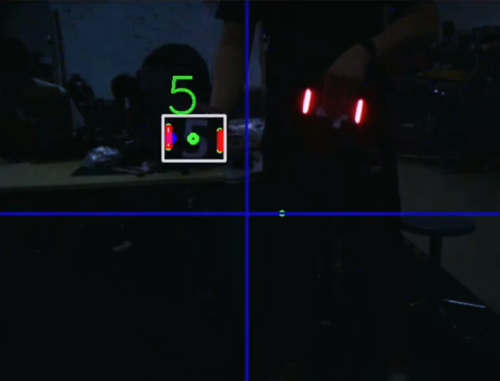

# **思玄战队RoboMaster2022视觉代码**

## 特别致谢：
`上海交通大学`、`桂林电子科技大学`、`华南师范大学`、`广州理工学院`、`沈阳航空航天大学`等视觉开源项目团队！

以及RoboMaster视觉交流群热心网友们的支持！

## 一、项目说明
### 自瞄装甲板识别

### 1、测试用例

> 运算设备：Intel NUC 11i7
>
> 视觉传感器：海康威视 MV-CA016-10UC 160万全局快门彩色工业相机
>
> 程序输入尺寸： 640 X 480  网络分类器输入尺寸: 43 X 36 X 3
>
> 单目标处理耗时：5~12 ms (网络推理耗时 2ms)

### 2、工作条件

务必保证摄像头焦距正确，同时镜片干净无污物。由于使用了数字识别，务必保证光照充足，图像上数字清晰可见。

光照不足时，调整摄像头曝光或增益数值，直到数字清晰可见。如有需要可针对实际环境情况调整白平衡。

### 3、功能演示

## 二、项目相关文档

环境安装请参阅 `《环境配置手册》`

程序调试请参阅 `《代码调试说明》`

实战使用请参阅 `《操作手使用手册》`