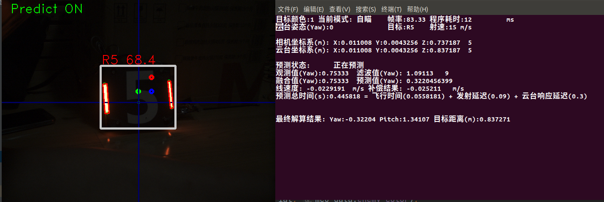

# **思玄战队RoboMaster2022视觉代码**

## 特别致谢：
上海交通大学、桂林电子科技大学、华南师范大学、广州理工学院等视觉开源项目团队！

以及RoboMaster视觉交流群热心网友们的支持！

## 一、项目说明
### 自瞄装甲板识别

首先对图像进行通道拆分以及二值化操作，再进行开闭运算，通过边缘提取和条件限制得出可能为灯条的部分。再对所有可能的灯条进行两两匹配，根据形状大小特性进行筛选，得出可能为装甲板的候选区。然后把所有候选区交给分类器判断，得出真实的装甲板及其数字id。最后根据优先级选取最终击打目标以及后续处理。

### 1、BenchMark 测试用例

> 运算设备：Intel NUC8i7
>
> 视觉传感器：海康威视 MV-CA016-10UC 160万全局快门彩色工业相机
>
> 程序输入尺寸： 640 X 480  网络分类器输入尺寸: 43 X 36 X 3
>
> 平均处理帧率：90+FPS

### 2、环境配置
>操作系统版本：Ubuntu18.04
>
>相机驱动下载：[海康机器人开发下载中心](https://www.hikrobotics.com/cn/machinevision/service/download?module=0)
>
>OpenCV库：推荐OpenCV4.1及以上(最低支持OpenCV3.4.5)
>
>Eigen库下载: sudo apt install libeigen3-dev

详见《环境配置手册》，对于其他版本，未经过充分测试，不保证运行兼容性。

### 3、工作条件

务必保证摄像头焦距正确，同时镜片干净无污物。由于使用了数字识别，务必保证光照充足，图像上数字清晰可见。光照不足时，调整摄像头曝光或增益数值，直到数字清晰可见。如有需要可针对实际环境情况调整白平衡。

## 二、项目相关文档

环境安装请参阅 《环境配置手册》

程序调试请参阅 《代码调试说明》

实战使用请参阅 《操作手使用手册》