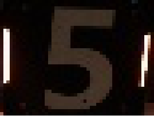

## LetNet-5 模型训练说明 V1.0

## 环境要求：
建议使用`Python3.6` or `Python 3.7` （因为要支持TensorFlow 1.x)

`tensorflow 1.x`
`tqdm`
`opencv-python`
`matplotlib`
## 训练步骤：
### 一、采集图像数据
1、建立数据文件夹用于保存采集的数据 (本目录下提供了一个空的文件夹示例)

2、在程序参数中开启 `数据采集模式` 和 `分类器模式`, 识别到的装甲板候选区(ROI)图片将自动归类储存到对应子文件夹中。

**数据图片示例 （48x36）：**

### 二、数据清洗
由于识别场景通过低曝光限定，RM的分类识别完全可以通过训练处限定场景下的过拟合就达到不错的分类精度。

* **建议采集场景： 环境光强、装甲板角度变换**
* **建议单个id的有效训练样本量：3000+**
* ****

1、数据采样，降低重复率：
> 由于高帧率下，数据采集样本重复率高，首先要剔除重复的数据，可通过脚本对数据进行采样。

2、将分类不清晰剔除

3、将分类错误的文件归类到正确类别文件夹中

### 三、开始训练
1、检查数据文件路径，调试训练超参数

2、 运行`backward.py`

### 四、验证模型
将新生成的模型文件替换旧的即可（建议对历史模型进行备份）

### 其他注意事项
训练中途请勿打断